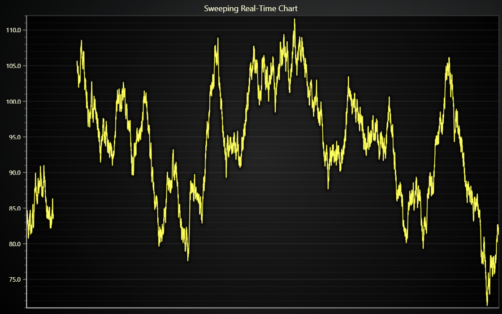

# JavaScript Sweeping Area Chart

This demo application belongs to the set of examples for LightningChart JS, data visualization library for JavaScript.

LightningChart JS is entirely GPU accelerated and performance optimized charting library for presenting massive amounts of data. It offers an easy way of creating sophisticated and interactive charts and adding them to your website or web application.

The demo can be used as an example or a seed project. Local execution requires the following steps:

-   Make sure that relevant version of [Node.js](https://nodejs.org/en/download/) is installed
-   Open the project folder in a terminal:

          npm install              # fetches dependencies
          npm start                # builds an application and starts the development server

-   The application is available at _http://localhost:8080_ in your browser, webpack-dev-server provides hot reload functionality.

## Description

Simple example of how to create sweeping real-time charts with LightningChart JS data edit API.

In this example, a real-time trend is displayed as an Area Chart.
New data points are appended to the right, until reaching the edge of the chart.
At this point, the new data starts appending again from left, clearing away the previously displayed data.

Contrary to traditional "scrolling" approach to displaying streaming data, this "sweeping" approach is often preferred by medical industries.

---

This approach to sweeping charts is very simple to implement, and works well up to 100 channels and 1 kHz stream rates.

However, if more performance is required, then there is an alternate and slightly more complicated approach which is showcased in [this example](https://lightningchart.com/js-charts/interactive-examples/examples/lcjs-example-0033-sweepingLineDashboard.html).

## API Links

* [XY cartesian chart]
* [Line series]
* [Axis]

## Support

If you notice an error in the example code, please open an issue on [GitHub][0] repository of the entire example.

Official [API documentation][1] can be found on [LightningChart][2] website.

If the docs and other materials do not solve your problem as well as implementation help is needed, ask on [StackOverflow][3] (tagged lightningchart).

If you think you found a bug in the LightningChart JavaScript library, please contact sales@lightningchart.com.

Direct developer email support can be purchased through a [Support Plan][4] or by contacting sales@lightningchart.com.

[0]: https://github.com/Arction/
[1]: https://lightningchart.com/lightningchart-js-api-documentation/
[2]: https://lightningchart.com
[3]: https://stackoverflow.com/questions/tagged/lightningchart
[4]: https://lightningchart.com/support-services/

© LightningChart Ltd 2009-2025. All rights reserved.

[XY cartesian chart]: https://lightningchart.com/js-charts/api-documentation/v8.1.0/classes/ChartXY.html
[Line series]: https://lightningchart.com/js-charts/api-documentation/v8.1.0/classes/PointLineAreaSeries.html
[Axis]: https://lightningchart.com/js-charts/api-documentation/v8.1.0/classes/Axis.html

